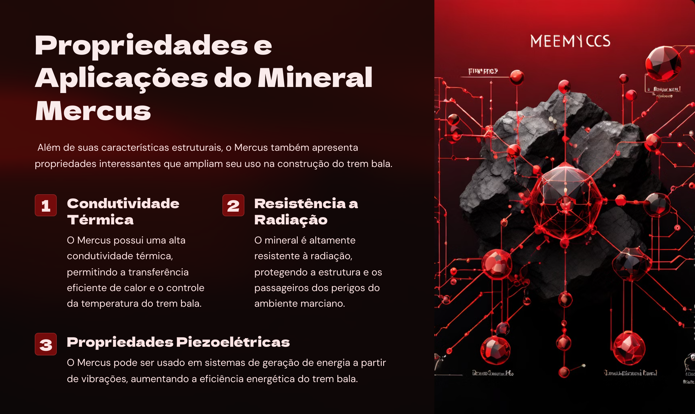
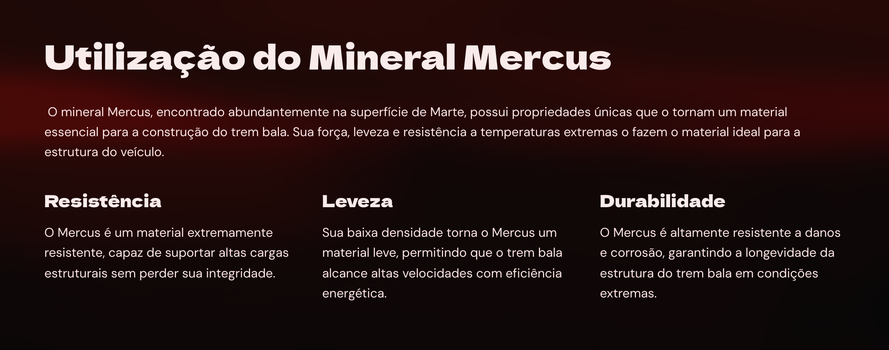
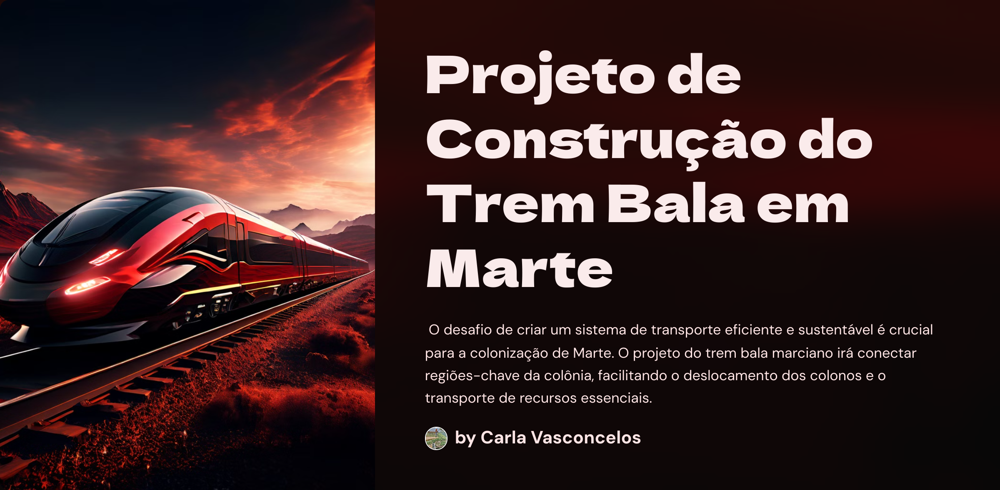

# Natural ou Fake Natty? Como Vencer na Era das IAs Generativas

# Trem Bala em Marte: Mercus e a Revolução no Transporte Marciano 🚀

## 📒 Descrição
Este projeto explora a construção de um trem bala em Marte, utilizando o mineral exclusivo mercus, essencial para a criação de um combustível eficiente. Além de facilitar o transporte dos colonos, o trem bala é crucial para o transporte das batatas azuis, um alimento básico na dieta marciana. Este trabalho foi desenvolvido como parte do desafio **Natural ou Fake Natty? Como Vencer na Era das IAs Generativas** da DIO.

## 🤖 Tecnologias Utilizadas
- Gamma.app para criação de slides
- Ferramentas de IA Generativa para conteúdo textual
- Edição de imagens e diagramação

## 🧐 Processo de Criação
1. **Pesquisa e Desenvolvimento**: Baseado em informações sobre colonização de Marte, minerais exclusivos e tecnologias de transporte, criei um conteúdo narrativo sobre o projeto do trem bala.
2. **Ferramentas de IA**: Utilizei o ChatGPT para desenvolver o texto explicativo e narrativo sobre o trem bala e o mineral mercus.
3. **Criação de Slides**: Com o Gamma.app, organizei e apresentei o conteúdo em um formato visualmente atraente e informativo.
4. **Organização dos Recursos**: Criei duas pastas – 'assets' para armazenar as imagens do projeto e 'projeto' para o arquivo do projeto em si.

## 🚀 Resultados
- Um conjunto de slides que detalha o projeto do trem bala em Marte, explicando a importância do mineral mercus e o transporte das batatas azuis.
- Um README detalhado que documenta o processo de criação e as tecnologias utilizadas.
- Um portfólio enriquecido com um projeto inovador e criativo, utilizando IAs Generativas.

## 💭 Reflexão
Este desafio foi uma oportunidade única para explorar o potencial das IAs Generativas na criação de conteúdos realistas e inovadores. Desenvolver um projeto 'natty' com IA não só foi uma experiência enriquecedora, mas também demonstrou como essas tecnologias podem ser aplicadas para resolver problemas complexos e criar narrativas envolventes. No entanto, é crucial refletir sobre o poder de criar "fake nattys" usando IA. A capacidade de gerar conteúdos tão realistas pode desafiar a autenticidade e a confiança em informações digitais. Com isso, vem a responsabilidade de usar essas ferramentas de forma ética e consciente, garantindo transparência e veracidade na criação e disseminação de conteúdos.

---

## 📂 Imagens do Projeto

## 📄 [Clique aqui para ler o projeto completo](projeto/Projeto-de-Construcao-do-Trem-Bala-em-Marte.pdf)

